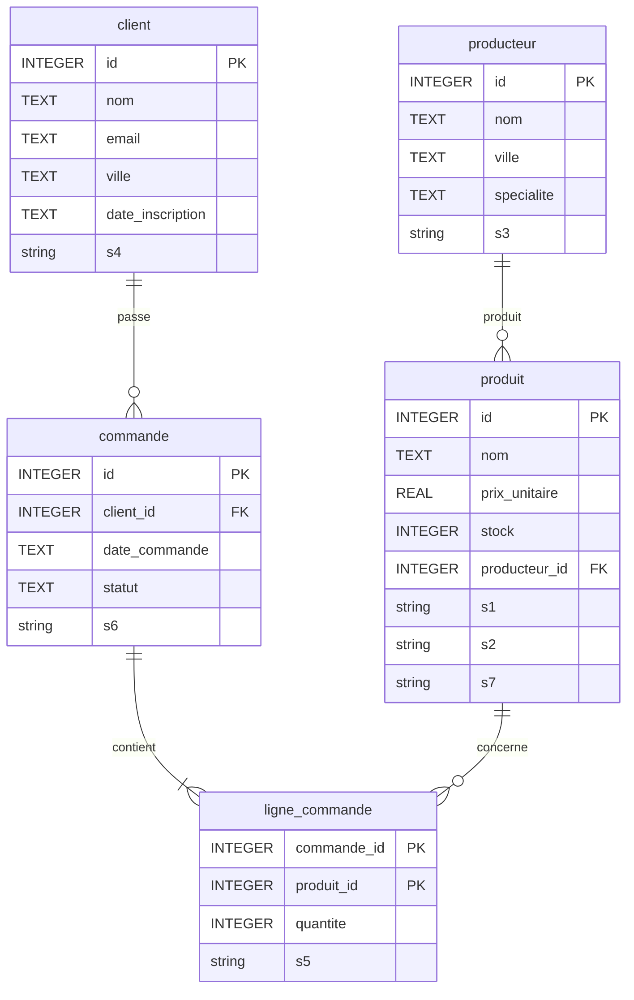

```mermaid
erDiagram
    producteur {
        INTEGER id PK
        TEXT nom
        TEXT ville
        TEXT specialite
        string s3
    }
    produit {
        INTEGER id PK
        TEXT nom
        REAL prix_unitaire
        INTEGER stock
        INTEGER producteur_id FK
        string s1
        string s2
        string s7
    }
    client {
        INTEGER id PK
        TEXT nom
        TEXT email
        TEXT ville
        TEXT date_inscription
        string s4
    }
    commande {
        INTEGER id PK
        INTEGER client_id FK
        TEXT date_commande
        TEXT statut
        string s6
    }
    ligne_commande {
        INTEGER commande_id PK
        INTEGER produit_id PK
        INTEGER quantite
        string s5
    }
    producteur ||--o{ produit : produit
    client ||--o{ commande : passe
    commande ||--|{ ligne_commande : contient
    produit ||--o{ ligne_commande : concerne
```